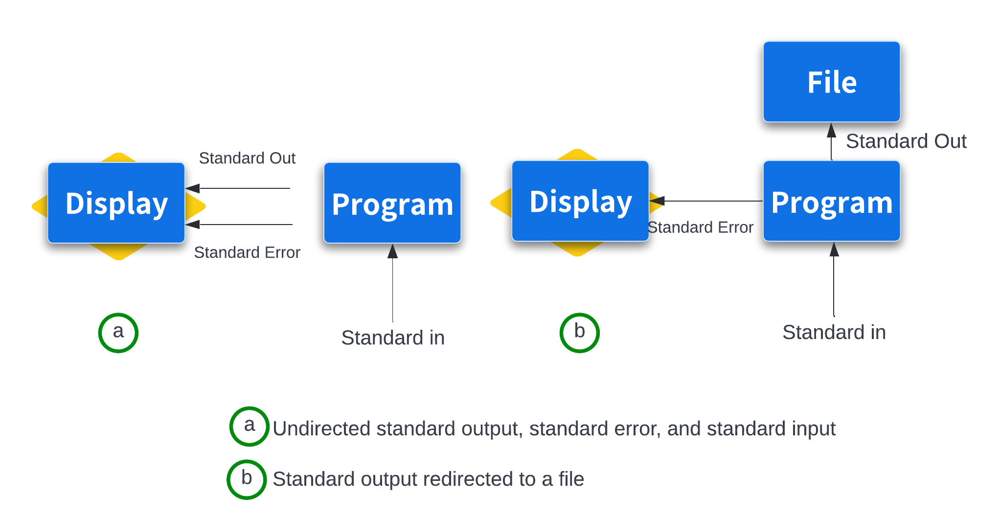

# Streams, Redirection and Pipe

!!! clipboard-list "Lesson Objectives"

    - To be able to redirect streams of data in Unix.
    - Solve problems by piping several Unix commands.
    - Command substitution 

Bioinformatics data is often text-based and large. This is why Unix’s philosophy of handling text streams is useful in bioinformatics: text streams allow us to do processing on a stream of data rather than holding it all in memory. Handling and redirecting the streams of data is an essential skill in Unix.

<figure markdown>
  { width="590" }
</figure>


By default, both standard error and standard output of most unix programs go to your terminal screen. We can change this behavior (redirect the streams to a file) by using `>` or `>>` operators. The operator `>` redirects standard output to a file and overwrites any existing contents of the file, whereas `>>` appends to the file. If there isn’t an existing file, both operators will create it before redirecting output to it. 

### Output redirection

The `shell4b_data` directory contains the following fasta files:

```
tb1.fasta
tb1-protein.fasta
tga1-protein.fasta
```

We can use the `cat` command to view these files either one at a time:

??? backward "Recap - `cat` command to view the content of *a* file"
    !!! terminal "code"
    
        ```bash
        cat tb1-protein.fasta
        ```
        ??? success "output"
    
            ```bash
            >teosinte-branched-1 protein
            LGVPSVKHMFPFCDSSSPMDLPLYQQLQLSPSSPKTDQSSSFYCYPCSPP
            FAAADASFPLSYQIGSAAAADATPPQAVINSPDLPVQALMDHAPAPATEL
            GACASGAEGSGASLDRAAAAARKDRHSKICTAGGMRDRRMRLSLDVARKF
            FALQDMLGFDKASKTVQWLLNTSKSAIQEIMADDASSECVEDGSSSLSVD
            GKHNPAEQLGGGGDQKPKGNCRGEGKKPAKASKAAATPKPPRKSANNAHQ
            VPDKETRAKARERARERTKEKHRMRWVKLASAIDVEAAAASVPSDRPSSN
            NLSHHSSLSMNMPCAAA
            ```
    
    !!! terminal "code"
    
        ```bash
        cat tga1-protein.fasta 
        ```
        ??? success "output"
    
            ```bash
            >teosinte-glume-architecture-1 protein
            DSDCALSLLSAPANSSGIDVSRMVRPTEHVPMAQQPVVPGLQFGSASWFP
            RPQASTGGSFVPSCPAAVEGEQQLNAVLGPNDSEVSMNYGGMFHVGGGSG
            GGEGSSDGGT
            ```

OR all at once with `cat *.fasta`

We can also redirect the output to create a new file containing the sequence for both proteins:

!!! terminal "code"

    ```bash
    cat tb1-protein.fasta tga1-protein.fasta > zea-proteins.fasta
    ```

Now we have a new file called `zea-proteins.fasta`. Let's check the contents:

!!! terminal "code"

    ```bash
    cat zea-proteins.fasta
    ``` 
    ??? success "output"   
        ```bash
        >teosinte-branched-1 protein
        LGVPSVKHMFPFCDSSSPMDLPLYQQLQLSPSSPKTDQSSSFYCYPCSPP
        FAAADASFPLSYQIGSAAAADATPPQAVINSPDLPVQALMDHAPAPATEL
        GACASGAEGSGASLDRAAAAARKDRHSKICTAGGMRDRRMRLSLDVARKF
        FALQDMLGFDKASKTVQWLLNTSKSAIQEIMADDASSECVEDGSSSLSVD
        GKHNPAEQLGGGGDQKPKGNCRGEGKKPAKASKAAATPKPPRKSANNAHQ
        VPDKETRAKARERARERTKEKHRMRWVKLASAIDVEAAAASVPSDRPSSN
        NLSHHSSLSMNMPCAAA
        >teosinte-glume-architecture-1 protein
        DSDCALSLLSAPANSSGIDVSRMVRPTEHVPMAQQPVVPGLQFGSASWFP
        RPQASTGGSFVPSCPAAVEGEQQLNAVLGPNDSEVSMNYGGMFHVGGGSG
        GGEGSSDGGT
        ```

Capturing error messages

!!! terminal "code"

    ```bash
    cat tb1-protein.fasta mik.fasta
    ```
    >```bash
    >>teosinte-branched-1 protein
    >LGVPSVKHMFPFCDSSSPMDLPLYQQLQLSPSSPKTDQSSSFYCYPCSPP
    >FAAADASFPLSYQIGSAAAADATPPQAVINSPDLPVQALMDHAPAPATEL
    >GACASGAEGSGASLDRAAAAARKDRHSKICTAGGMRDRRMRLSLDVARKF
    >FALQDMLGFDKASKTVQWLLNTSKSAIQEIMADDASSECVEDGSSSLSVD
    >GKHNPAEQLGGGGDQKPKGNCRGEGKKPAKASKAAATPKPPRKSANNAHQ
    >VPDKETRAKARERARERTKEKHRMRWVKLASAIDVEAAAASVPSDRPSSN
    >NLSHHSSLSMNMPCAAA
    >cat: mik.fasta: No such file or directory
    >```

There are two different types of output there: <span style="color:blue">***standard output***</span> (the contents of the `tb1-protein.fasta` file) and <span style="color:red">***standard error***</span> (the error message relating to the missing `mik.fasta` file). If we use the `>` operator to redirect the output, the standard output is captured, but the standard error is not - it is still printed to the screen.  Let's check:

!!! terminal "code"
     ``` bash
     cat tb1-protein.fasta mik.fasta > test.fasta
     
       cat: mik.fasta: No such file or directory
     ```

The new file has been created and contains the standard output (contents of the file `tb1-protein.fasta`):

!!! terminal "code"
    ```bash
    cat test.fasta
    ```
    ??? success "output"

        ```bash
        >teosinte-branched-1 protein
        LGVPSVKHMFPFCDSSSPMDLPLYQQLQLSPSSPKTDQSSSFYCYPCSPP
        FAAADASFPLSYQIGSAAAADATPPQAVINSPDLPVQALMDHAPAPATEL
        GACASGAEGSGASLDRAAAAARKDRHSKICTAGGMRDRRMRLSLDVARKF
        FALQDMLGFDKASKTVQWLLNTSKSAIQEIMADDASSECVEDGSSSLSVD
        GKHNPAEQLGGGGDQKPKGNCRGEGKKPAKASKAAATPKPPRKSANNAHQ
        VPDKETRAKARERARERTKEKHRMRWVKLASAIDVEAAAASVPSDRPSSN
        NLSHHSSLSMNMPCAAA
        ```

If we want to capture the standard error we use the (slightly unweildy) `2>` operator:

!!! terminal "code"

    ```bash
    cat tb1-protein.fasta mik.fasta > test.fasta 2> stderror.txt
    ```

!!! user-secret "Descriptors"

    File descriptor `2` represents standard error (other special file descriptors include `0` for standard input and `1` for standard output).

Check the contents:

!!! terminal "code"
    
    ```bash
    cat stderror.txt
    
      cat: mik.fasta: No such file or directory
    ```
!!! warning "Reminder :`>` vs `>>`"

    Note that `>` will overwrite an existing file. We can use `>>` to add to a file instead of overwriting it:

!!! terminal "code"

    ```bash
    cat tga1-protein.fasta >> test.fasta
    ```
    ```bash
    cat test.fasta 
    ```
    ??? success "output"

        ```bash
        >teosinte-branched-1 protein
        LGVPSVKHMFPFCDSSSPMDLPLYQQLQLSPSSPKTDQSSSFYCYPCSPP
        FAAADASFPLSYQIGSAAAADATPPQAVINSPDLPVQALMDHAPAPATEL
        GACASGAEGSGASLDRAAAAARKDRHSKICTAGGMRDRRMRLSLDVARKF
        FALQDMLGFDKASKTVQWLLNTSKSAIQEIMADDASSECVEDGSSSLSVD
        GKHNPAEQLGGGGDQKPKGNCRGEGKKPAKASKAAATPKPPRKSANNAHQ
        VPDKETRAKARERARERTKEKHRMRWVKLASAIDVEAAAASVPSDRPSSN
        NLSHHSSLSMNMPCAAA
        >teosinte-glume-architecture-1 protein
        DSDCALSLLSAPANSSGIDVSRMVRPTEHVPMAQQPVVPGLQFGSASWFP
        RPQASTGGSFVPSCPAAVEGEQQLNAVLGPNDSEVSMNYGGMFHVGGGSG
        GGEGSSDGGT
        ```

### The Unix pipe

The pipe operator (`|`) passes the output from one command to another command as input.  The following is an example of using a pipe with the `grep` command.

Steps:

1. Remove the header information for the sequence (line starts with ">")
2. Highlight any characters in the sequence that *are not* A, T, C or G.

We will use grep to carry out the first step, and then use the pipe operator to pass the output to a second grep command to carry out the second step.

Here is the full command:

!!! terminal "code"

    ```bash 
    grep -v "^>" tb1.fasta | grep --color -i "[^ATCG]"
    ```

!!! magnifying-glass "Let's see what each piece does" 

    `grep -v "^>" tb1.fasta`
 
    - `-v`: Inverts the match, selecting non-matching lines
    - `"^>"`: The pattern to match. ^ means start of line, > is the literal character

    `grep --color -i "[^ATCG]"`

    There are a few things going on here:

    - `--color`: tells `grep` to highlight any matches
    - `-i`: tells `grep` to ignore the case (i.e., will match lower or upper case)
    - `[^ATCG]`: when `^` is used *inside square brackets* it has a different function - *inverts* the pattern, so that `grep` finds any letters that are *not* A, T, C or G. In other words,  `[^...]` means "any character not in this set"

    ??? clipboard-question "Why is this useful"

        - Identifying non-standard nucleotides in a DNA sequence
        - Spotting potential sequencing errors
        - Quality control of DNA sequence data

Let's run the code:

!!! terminal "code"

    ```bash
    grep -v "^>" tb1.fasta | grep --color -i "[^ATCG]"
    ```

    ??? success  "Output"

        CCCCAAAGACGGACCAATCCAGCAGCTTCTACTGCTA<span style="color:red">Y</span>CCATGCTCCCCTCCCTTCGCCGCCGCCGACGC


### Combining pipes and redirection

!!! terminal-2 "redirect the standard output of above `grep..` command to `non-atcg.txt`"

    ```bash
    grep -v "^>" tb1.fasta | grep --color -i "[^ATCG]" > non-atcg.txt
    ```
!!! terminal "code"

    ```bash
    cat non-atcg.txt 
    ```

since we are redirecting to a text file, the `--color` by itself will not record the colour information. We can achieve this by invoking `always` flag for `--color`.i.e..

!!! terminal "code"

    ```bash
    grep -v "^>" tb1.fasta | grep --color=always -i "[^ATCG]" > non-atcg.txt
    ```
### Using tee to capture intermediate outputs

!!! terminal "code"

    ```bash
    grep -v "^>" tb1.fasta | tee intermediate-out.txt | grep --color=always -i "[^ATCG]" > non-atcg.txt
    ```

The file `intermediate-out.txt` will contain the output from `grep -v "^>" tb1.fasta`, but `tee` also passes that output through the pipe to the next `grep` command.

??? truck-ramp "Preview - This is to be covered in "Advanced Shell for Bioinformatics"<br>*Pipes and Chains and Long running processes  : Exit Status (Programmatically Tell Whether Your Command Worked)*"


    How do you know when they complete? How do you know if they successfully finished without an error? Unix programs exit with an exit status, which indicates whether a program terminated without a problem or with an error. By Unix standards, an exit status of `0` indicates the process ran successfully, and any **nonzero** status indicates some sort of error has occurred (and hopefully the program prints an understandable error message, too). The exit status isn’t printed to the terminal, but your shell will set its value to a shell variable named   `$?`. We can use the `echo` command to look at this variable’s value after running a command:
    
    ```bash
    program input.txt > results.txt; echo $?
    ```
    Exit statuses are useful because they allow us to programmatically chain commands together in the shell. A subsequent command in a chain is run conditionally on the last command’s exit status. The shell provides two operators that implement this: one operator that runs the subsequent command only if the first command completed successfully (`&&`), and one operator that runs the next command only if the first completed unsuccessfully (`||`).
    
    For example, the sequence `program1 input.txt > intermediate-results.txt && program2 intermediate-results.txt > results.txt` will execute the second command only if previous commands have completed with a successful zero exit status.
    
    By contrast, `program1 input.txt > intermediate-results.txt || echo "warning: an error occurred"` will print the message if error has occurred.
    
    !!! quote "" 
        When a script ends with an **exit** that has no parameter, the exit status of the script is the exit status of the last command executed in the script (previous to the **exit**).
    
    !!! clipboard-question "Exit Status : using `&&` and `||`"
        To test your understanding of `&&` and `||`, we’ll use two Unix commands that do nothing but return either exit success (true) or exit failure (false). Predict and check the outcome of the following commands:
    
        ```bash
        true
        echo $?
        false
        echo $?
        true && echo "first command was a success"
        true || echo "first command was not a success" 
        false || echo "first command was not a success"
        false && echo "first command was a success"
        ```
        !!! tip "hint"
            The `$?` variable represents the exit status of the previous command.
    
        ??? success "Answer"
    
            ```bash
            ~$ true 
            ~$ echo $?
            0
            ~$ false
            ~$ echo $?
            1
            ~$ true && echo "first command was a success"
            first command was a success
    
            ~$ true || echo "first command was not a success"
            ~$ false || echo "first command was not a success"
            first command was not a success
    
            ~$ false && echo "first command was a success"
            ~$ 
            ```


### Command Substitution

Unix users like to have the Unix shell do the work for them. This is why shell expansions like wildcards and brace expansion exist. Another type of useful shell expansion is command substitution. Command substitution runs a Unix command inline and returns the output as a string that can be used in another command. This opens up a lot of useful possibilities. For example, if you want to include the results from executing a command into a text, you can type:

!!! terminal-2 "Which is better ?"
    ```bash
    grep -c '^@' SRR097977.fastq
    ```
    <center>**OR**</center>

    ```bash
    echo "There are $(grep -c '^@' SRR097977.fastq) entries in my FASTA file."
    ```
    !!! info ""

    - `echo`: This is a command that prints text to the standard output.
    - The text in quotes is what will be printed, with a substitution: "There are ... entries in my FASTA file."
    - `$(...)`: This is command substitution. It runs the command inside the parentheses and replaces itself with the output of that command.
    - `grep -c '^@' SRR097977.fastq`: This is the command inside the substitution:
        - `-c`: An option that tells grep to count matching lines instead of printing them
        - `'^@'`: The pattern to search for. In this case, it's looking for lines that start with '@'

    - So, this command will:
        - Count how many lines in SRR097977.fastq start with '@'
        - Substitute that number into the echo statement
        - Print the resulting message!

Another example of using command substitution would be creating dated directories:

!!! terminal "code"

    ```bash
    mkdir results-$(date +%F)
    ```
    !!! clipboard-question ""

        * `%F` - full date; same as `%Y-%m-%d`
        


??? magnifying-glass "Bonus: Recap of for loops and basename" 

    In our [Introduction to Shell for bioinformatics](https://genomicsaotearoa.github.io/introduction-to-shell/04-redirection/#writing-for-loops) workshop, we introduced for loops and using the command`basename`. This is a very common scenario where you will encounter using command substitution, along with creating shell variables within a loop.

    First, make a new dir and `cd` into it:

    !!! terminal "code"

        ```bash
        mkdir forloops && cd $_
        ```
 
    - `&&` :  This allows us to run multiple commands in one line. The command on the right only proceeds if the left was successful.   
    - `cd $_` : The `$_` expands to the last argument of the previous command, which here was  `forloops` (the directory name you just passed to `mkdir`). So `cd $_` changes into the directory you just created, without having to type its name again.  

    Let's create a few dummy files to recap using forloops and basename:

    !!! terminal "code"

        ```bash
        touch file1.txt; touch file2.txt; touch file3.txt
        ```

    - `;` : This also allows us to run multiple commands in one line, but unlike `&&`, does not require the first command to be successful in order to proceed with the next command. 

    Let's say we want to rename our files from `file#.txt` to `file#_year.txt`. We can make use of multiple **command substitutions** within a for loop to achieve this:

    !!! terminal "code"

        ```bash
        for file in *.txt
        do
        name=$(basename ${file} .txt)
        mv ${file} ${name}_$(date +%Y).txt
        done
        ```

    Then check the output of the for loop with `ls`:
    
    !!! terminal "code"
        
        ```bash
        ls
        ```

        !!! success "Output"

            ```
            file1_2026.txt	file2_2026.txt	file3_2026.txt
            ```

    What is going on in the for loop above?

    First we create a list of all out `.txt` files, and each file name will get substituted in place of ${file} one at a time as the loop proceeds, until no more items in the list are left.

    Then, we create a shell variable called `name`.  As the loop proceeds, the `name` variable gets reassigned too each round. This is where we first use command substitution to create `name`. The output of basename will become the `name` variable. Basename will look at the file name in `${file}` (e.g., file1.txt) and will strip off the suffix indicated by the second argument, which here is `.txt`. Therefore, `name=file1` in the first round through the loop. 

    Our next command is using `mv` to rename our file. The first argument is the file to be renamed, so we use `${file}` to grab the full file name one at a time. Then we need to specify in the second argument how we want to rename the file. It's here that we can name use of command substitution again to get the current year using the `date +%Y` command. The underscore between our two variables `$name` and `$(date +%Y)` is just an underscore! 
    
    Together, for the first round of the loop this translates as:

    ```bash
    mv file1.txt file1_2026.txt
    ```

    ???+ dumbbell  "Exercise: Rename the files again to remove the year"

        Use a for loop and basename to remove the year from the files, returning them once again to `file#.txt`.

        ??? success "Solution"
            
            ```bash
            for file in *.txt
            do
            name=$(basename ${file} _2026.txt)
            mv ${file} ${name}.txt
            done
            ```


## Extra: Shell variables, environment and subshell


### Shell variables

We've already been creating and using shell variables – in the for loop above (bonus content recap from intro R) `file` and `name` were both shell variables, reassigned each time through the loop. The shell also sets some variables for you automatically, like `$USER`:

!!! terminal "code"

    ```bash
    echo $USER
    ```


You can create your own the same way:

!!! terminal "code"

    ```bash
    myvar="hello"
    echo $myvar
    ```
    
    !!! success "Output"

        ```bash
        hello
        ```

!!! warning "No spaces around `=`"

    `myvar = "hello"` will *not* work – the shell interprets this as trying to run a command called `myvar` with arguments `=` and `hello`. It must be `myvar="hello"`, no spaces.

To see all the shell variables currently defined (including functions), use `set`:

!!! terminal "code"

    ```bash
    set | less
    set | grep 'myvar'
    ```

This is often a long list, so we can pipe into `less`  to let us page through it (press `q` to quit), or you can use `grep` to show any lines with the text myvar.  


### Environment variables

A plain shell variable like `myvar` only exists in your *current* shell. If you run a bash script, that script starts up as its own separate process - it won't automatically see variables from your current shell.

!!! terminal "code"

    ```bash
    echo 'echo "My variable is: $myvar"' > checkvar.sh
    bash checkvar.sh
    ```
    !!! success "Output"

        ```bash
        My variable is:
        ```

To make a variable visible to scripts and other programs you run, we need to **export** it - this turns it into an *environment variable*:

!!! terminal "code"

    ```bash
    export myvar="hello"
    bash checkvar.sh
    ```
    !!! success "Output"

        ```bash
        My variable is: hello
        ```

To see all currently exported (environment) variables, use `env`:

!!! terminal "code"

    ```bash
    env
    ```

!!! info ""

    - `set` shows **all** shell variables and functions (local to this shell)
    - `env` shows only the **exported** ones (visible to scripts and other programs too)

    `$PATH` is a good example of a variable that needs to be exported - it tells the shell where to look for programs, and every program you run needs to be able to see it.


!!! circle-info "Where do all these variables come from?"

    `set` and `env` often show dozens of variables you never typed yourself. These come from a few places:

    - The system, before bash even starts (*e.g.,* `$HOME`, `$USER`, `$SHELL`)
    - System-wide startup files, which may apply to every user on the machine  
    - Your own `~/.bashrc`, which is re-run every time you open a new interactive shell
    - Anything exported manually during your current session (like our `export myvar="hello"` above) - these only last until you close that shell

### Removing variables

- `unset variable` removes the variable completely 
- `export -n variable` removes just the *export* attribute - the variable still exists in your current shell, but it's just no longer passed on to scripts or other programs.

!!! terminal "code"

    ```bash
    export -n myvar
    echo $myvar          # still works, still in this shell
    bash checkvar.sh      # empty, no longer exported
    ```

### `.bashrc`

Every time you open a new interactive shell (*e.g.,* a new terminal, or logging into REANNZ), bash reads a startup file called `.bashrc` in your home directory (if you are working on macOS, your default shell is likely `zsh` and you will have a `.zshrc` file instead). This is where people commonly set things they want available *every* time, without having to retype them, for example:

- setting `$PS1` to [customise your prompt](https://bash-prompt-generator.org/) 
- defining aliases, e.g. `alias ll='ls -lh'`
- exporting `$PATH` additions, so the shell can find tools you've installed

!!! terminal "code"

    ```bash
    nano ~/.bashrc
    ```

You might, for example, add lines like:

!!! terminal-2 "This is just an example, we won't change these today. Some version of these already exist in your `.bashrc` on REANNZ"

    ```bash
    PS1='\u@\h:\w\$ '
    alias ll='ls -lh'
    export PATH="$HOME/bin:$PATH"
    ```


Save, then either open a new terminal or re-read the file into your current shell with:

!!! terminal "code"

    ```bash
    source ~/.bashrc
    ```

!!! clipboard-question ""

    Notice `PATH` is exported but `PS1` and the alias aren't - that's because `PATH` needs to be visible to other programs you run, whereas your prompt and aliases are only ever used by your interactive shell itself.


### Subshell: Grouping commands with `( )`

We've already used `;` to run multiple commands one after another on a single line:

!!! terminal-2 "Example code"

    ```bash
    touch file1.txt; touch file2.txt; touch file3.txt
    ```

Sometimes we want to treat a sequence of commands like this as a single unit - for example, so we can send the same input to all of them, or redirect all of their output together. We can do this by wrapping the commands in parentheses `( )`. This creates what's called a **subshell** - a separate instance of the shell that runs just those commands, as a group.

### Redirecting input with `<`

Before we combine subshells with redirection, a quick recap: so far we've used `>` to redirect a command's output *to* a file. We can also redirect a file's contents *into* a command as input, using `<`. For example, instead of:

!!! terminal "code"

    ```bash
    head -n 2 tb1.fasta
    ```

we could write:

!!! terminal "code"

    ```bash
    head -n 2 < tb1.fasta
    ```

Both give the same result here - `head` just receives the file's contents as input rather than being told a filename directly.

### Combining `( )` and `<`

The real benefit of grouping commands with `( )` shows up when we want to send *one* file as input to *several* commands at once, rather than specifying the file separately for each:

!!! terminal "code"

    ```bash
    (head -n 2; tail -n 2) < tb1.fasta
    ```

Without the `( )`, `<` would only apply to the command written right next to it - `tail` - and `head` would run with no input at all, just sitting and waiting for you to type something at the keyboard. Wrapping both commands in `( )` lets the single redirect apply to the pair together.


??? circle-info "Grouping output"

    `( )` isn't just for input - it's just as handy for combining several commands' *output* into a single redirect. For example, instead of writing to `report.txt` twice:

    ```bash
    echo "Line report for tb1.fasta" > report.txt
    wc -l tb1.fasta >> report.txt
    ```

    we can group the commands and redirect once:

    ```bash
    (echo "Line report for tb1.fasta"; wc -l tb1.fasta) > report.txt

    cat report.txt
    ```

    !!! success "Output"

        ```
        Line report for tb1.fasta
        27 tb1.fasta
        ```

!!! warning "Careful: commands share the same input stream"

    When several commands in `( )` all read from the same redirected input, they don't each get their own separate copy of the file - they share *one* stream, and each command consumes however much of it they read. Whatever one command uses up is gone by the time the next command runs.

    `head` and `tail` worked well together above because `head` only reads the first few lines it needs, leaving the rest of the stream for `tail`. But some commands read the *entire* input, which can leave nothing for whatever runs after them:

    !!! terminal "code"

    ```bash
    (wc -l; head -n 10) < tb1.fasta
    ```
    !!! success "Output"

        ```bash
        27
        ```

    `wc -l` reads through the whole file to count its lines, consuming the entire stream in the process. By the time `head -n 10` runs, there's nothing left to read - so it prints nothing at all.

    Key takeaway: `( )` with a shared `<` input works cleanly when the commands only take the part of the stream they need (like `head`/`tail`), but can behave unexpectedly if one command reads everything before the next has a turn.

