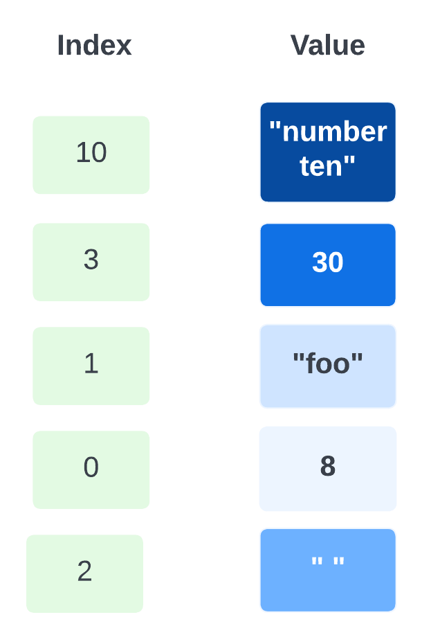

# 4. Inspecting and Manipulating Text Data with Unix Tools - Part 2

!!! clipboard-list "Lesson Objectives"
     
    * insertion, deletion, search and replace(substitution) with `sed`
    * Use specialised language `awk` to do a variety of text-processing tasks
    * Quick overview of `bioawk` (an extension of `awk` to process common biological data formats)

<center>
{width="200"}
</center>

## sed

The `s`treamline `ed`itor or `sed` command is a stream editor that reads one or more text files, makes changes or edits according to editing script, and writes the results to standard output. First, we will discuss sed command with respect to search and replace function. 

### Find and Replace

Most common use of `sed` is to substitute text, matching a pattern. The syntax for doing this in `sed` is as follows:

```bash
sed 'OPERATION/REGEXP/REPLACEMENT/FLAGS' FILENAME
```

!!! info ""


    - Here, `/` is the delimiter (you can also use `_` (underscore), `|` (pipe) or `:` (colon) as delimiter as well)
    - `OPERATION` specifies the action to be performed (sometimes if a condition is satisfied). 
         - The most common and widely used operation is `s` which does the **substitution** operation 
         - Other useful operators include `y` for **transformation**, `i` for **insertion**, `d` for **deletion** etc.).
    - `REGEXP` and `REPLACEMENT` specify search term and the substitution term respectively for the operation that is being performed.
    - `FLAGS` are additional parameters that control the operation. Some common `FLAGS` include:
        - `g`	replace all the instances of `REGEXP` with `REPLACEMENT` (globally)
        - `N` where N is any number, to replace Nth instance of the `REGEXP` with `REPLACEMENT`
        - `p` if substitution was made, then prints the new pattern space
        - `i` ignores case for matching `REGEXP`
        - `w` file If substitution was made, write out the result to the given file
        - `d` when specified without `REPLACEMENT`, deletes the found `REGEXP`

* Some find and replace examples


!!! terminal-2 "Find and replace all `chr` to `chromosome` in the example.bed file and append the the edit to a new file names example_chromosome.bed"

    ```bash
    sed 's/chr/chromosome/g' example.bed > example_chromosome.bed
    ```


!!! terminal-2 "Find and replace `chr` to `chromosome`, only if you also find **40** in the line"

    - This will follow the format `sed '/SEARCH_STRING/OPERATION/REGEXP/REPLACEMENT/FLAGS' FILENAME` where `SEARCH_STRING` is **40**
    ```bash
    sed '/40/s/chr/chromosome/g' example.bed > example_40.bed
    ```
!!! terminal-2 "Find and replace directly on the input, but save an old version too"

    ```bash
    sed -i.old 's/chr/chromosome/g' example.bed
    ```
    !!! info ""

        - `-i` to edit files **in-place** instead of printing to standard output
        - original file will be retained under the filename `example.bed.old`

* Print specific lines of the file

To print a specific line you can use the address function. Note that by default, `sed` will stream the entire file, so when you are interested in specific lines only, you will have to suppress this feature using the option `-n` 

!!! info ""
    `-n`, `--quiet`, `--silent` = suppress automatic printing of pattern space


!!! terminal-2 "print 5th line of example.bed"

    ```bash
    sed -n '5p' example.bed
    ```

    !!! info ""

    - `n:` This option suppresses the default output. Normally, sed prints every line of the input file to the standard output. The -n option tells sed to not print anything unless explicitly instructed to do so.
    - '5p': This is the command within sed. The 5 specifies the line number, and p stands for print. So, 5p means "print the 5th line".

!!! terminal-2 "We can provide any number of additional lines to print using `-e` option. This tells sed to execute the next command line argument as sed program Let's print line 2 and 5,"

    ```bash
    sed -n -e '2p' -e '5p' example.bed
    ```

    !!! info ""

    - `-e '2p'`: This is the first expression. The 2p part means "print the 2nd line".
    - `-e '5p'`: This is the second expression. The 5p part means "print the 5th line".

!!! terminal-2 "It also accepts range, using `,`. Let's print line 2-6,"

    ```bash
    sed -n '2,6p' example.bed
    ```

    !!! info ""

    - `'2,6p'`: This is the command within sed. The 2,6 specifies the range of lines, and p stands for print. So, 2,6p means "print lines 2 through 6"

!!! terminal-2 "Also, we can create specific pattern, like multiples of a number using `~`. Let's print every tenth line of Mus_musculus.GRCm38.75_chr1.bed starting from 10, 20, 30.. to end of the file"

    ```bash
    sed -n '10~10p' Mus_musculus.GRCm38.75_chr1.bed
    ```
    !!! info ""
    - `'10~10p'`: This is the key part of the command. It uses a special addressing syntax:
        - `10`: Start at line 10
        - `~10`: Then print every 10th line after that
        - `p`: The print command


???+ dumbbell "Exercise 4.4"

    Can you use the above `~` trick to extract all the **odd** numbered lines from Mus_musculus.GRCm38.75_chr1.bed and append the output to a new file **odd_sed.bed**

One of the powerful features is that we can combine these ranges or multiples in any fashion. Example: fastq files have header on first line and sequence in second, next two lines will have the quality and a blank extra line (four lines make one read). Sometimes  we only need the sequence and header

!!! terminal "code"

    ```bash
    sed -n '1~4p;2~4p' SRR097977.fastq
    ```
    !!! info ""
    - `'1~4p;2~4p'`: This is the sed script, which consists of two address/action pairs separated by a semicolon:
        - `1~4p`: This means "starting at line 1, print every 4th line"
        - `2~4p`: This means "starting at line 2, print every 4th line"

    ??? clipboard-question "Why is this userful ?"

        - Quickly view or extract just the sequence data and identifiers from a FASTQ file
        - Reduce the file size by removing quality score information
        - Prepare the data for further processing that only requires the sequence and its identifier
        
!!! tip "Sanity Check"

    It's not a bad practice validate some of these commands by comparing the output from another command. For an example, above `sed -n '1~4p;2~4p' SRR097977.fastq` should print exactly half the number of lines in the file as it is removing two lines per read. Do a quick sanity check with `sed -n '1~4p;2~4p' SRR097977.fastq  | wc -l` & `cat SRR097977.fastq | wc -l`


!!! terminal-2 "We can use the above trick to convert the .fastq to .fasta"

    ```bash
    sed -n '1~4p;2~4p' SRR097977.fastq  | sed 's/^@/>/g' > SRR097977.fasta
    ```
    !!! info ""
    - `^@`: Matches the `'@'` character at the beginning of a line
    - `>:` Replaces the matched `'@'` with `'>'`

    ??? clipboard-question "Why is this useful"
        - **Format Conversion**: It quickly converts a FASTQ file to a FASTA file, which is a common requirement in many bioinformatics workflows.
        - **Data Reduction**: It removes the quality score information, which is not used in FASTA format, potentially reducing file size.
        - **Compatibility**: Many bioinformatics tools work with FASTA format, so this conversion can be a necessary preprocessing step.
        - **Efficiency**: It performs the conversion using efficient text-processing tools, which can be faster than some scripted solutions, especially for large files.
        - **Pipeline Integration**: This one-liner can be easily integrated into larger bioinformatics pipelines or scripts.

<br>
??? surprise "Optional (Advanced) -Let's say that we want capture all the transcript names from the last column (9th column) from .gtf file. We can write something similar to:"

    !!! terminal "code"
    
        ```bash
        grep -v "^#" Mus_musculus.GRCm38.75_chr1.gtf | head -n 3 | sed -E 's/.*transcript_id "([^"]+)".*/\1/'
        ```
    !!! info ""
        `-E` option to enable POSIX Extended Regular Expressions (ERE)
    
        ??? pied-piper "POSIX Regular and Exetended Regular Expressions"
    
             **POSIX Basic Regular Expressions** 
    
             * POSIX or “Portable Operating System Interface for uniX” is a collection of standards that define some of the functionality that a (UNIX) operating system should support. One of these standards defines two flavors of regular expressions. Commands involving regular expressions, such as `grep` and `egrep`, implement these flavors on POSIX-compliant UNIX systems. Several database systems also use POSIX regular expressions.
            
                The Basic Regular Expressions or BRE flavor standardizes a flavor similar to the one used by the traditional UNIX `grep` command. This is pretty much the oldest regular expression flavor still in use today. One thing that sets this flavor apart is that most meta-characters require a backslash to give the metacharacter its flavor. Most other flavors, including POSIX ERE, use a backslash to suppress the meaning of metacharacters. Using a backslash to escape a character that is never a metacharacter is an error.
    
            **POSIX Extended Regular Expressions**
    
            * The Extended Regular Expressions or ERE flavor standardizes a flavor similar to the one used by the UNIX `egrep` command. “Extended” is relative to the original UNIX `grep`, which only had bracket expressions, dot, caret, dollar and star. An ERE support these just like a BRE. Most modern regex flavors are extensions of the ERE flavor. By today’s standard, the POSIX ERE flavor is rather bare bones. The POSIX standard was defined in 1986, and regular expressions have come a long way since then.
    
                The developers of `egrep` did not try to maintain compatibility with `grep`, creating a separate tool instead. Thus `egrep`, and POSIX ERE, add additional metacharacters without backslashes. You can use backslashes to suppress the meaning of all metacharacters, just like in modern regex flavors. Escaping a character that is not a meta-character is an error.
    
    
    Output is not really what we are after,
    
    >```bash
    >1	pseudogene	gene	3054233	3054733	.	+	.	gene_id "ENSMUSG00000090025"; gene_name "Gm16088"; gene_source "havana"; gene_biotype "pseudogene";
    >ENSMUST00000160944
    >ENSMUST00000160944
    >```
    
    The is due to `sed` default behaviour where it prints every line, making replacements to matching lines. .i.e Some lines of the last column of *Mus_musculus.GRCm38.75_chr1.gtf* don't contain `transcript_id`. So, `sed` prints the entire line rather than captured group. One way to solve this would be to use `grep` `transcript_id` before `sed` to only work with lines containing the string `transcript_id` . However, `sed` offers a cleaner way. First, disable `sed` from outputting all lines with `-n` ( can use `--quiet` or `--silent` as well .i.e. *suppress automatic printing of pattern space*). Then, by appending `p` (*Print the current pattern space*) after the last slash `sed` will print all lines it’s made a replacement on. The following is an illustration of `-n` used with `p`:
    
    !!! terminal "code"
    
        ```bash
        grep -v "^#" Mus_musculus.GRCm38.75_chr1.gtf | head -n 3 | sed -E -n 's/.*transcript_id "([^"]+)".*/\1/p'
        ```
    This example uses an important regular expression idiom: capturing text between delimiters (in this case, quotation marks). This is a useful pattern, so let’s break it
    down:
    
    1. First, match zero or more of any character ( .* ) before the string "transcript_id" .
    2. Then, match and capture (because there are parentheses around the pattern) one or more characters that are not a quote. This is accomplished with [^"]+ , the important idiom in this example. In regular extension jargon, the brackets make up a character class. Character classes specify what characters the expression is allowed to match. Here, we use a caret ( ^ ) inside the brackets to match anything except what’s inside these brackets (in this case, a quote). The end result is that we match and capture one or more nonquote characters (because there’s a trailing + ). This approach is nongreedy; often beginners make the mistake of taking a greedy
    approach and use .* . Consider:
    
- - - 
    

## Aho, Weinberger, Kernighan = AWK

Awk is a scripting language used for manipulating data and generating reports. The awk command programming language requires no compiling and allows the user to use variables, numeric functions, string functions, and logical operators. 

Awk is a utility that enables a programmer to write tiny but effective programs. These take the form of statements that define text patterns that are to be searched for in each line of a document, and the action that is to be taken when a match is found within a line. 

!!! quote ""

    Awk is mostly used for pattern scanning and processing. It searches one or more files to see if they contain lines that match with the specified patterns and then perform the associated actions. 

???+ "WHAT CAN WE DO WITH AWK?" 

      1. AWK Operations: 
         -  Scans a file line by line 
         -  Splits each input line into fields 
         -  Compares input line/fields to pattern 
         -  Performs action(s) on matched lines 

      2. Useful For: 
         -  Transform data files 
         -  Produce formatted reports 

      3. Programming Constructs: 
         - Format output lines 
         - Arithmetic and string operations 
         - Conditionals and loops 

!!! quote ""

    There are two key parts for understanding the Awk language: how Awk processes records, and pattern-action pairs. The rest of the language is quite simple.

    * Awk processes input data a record (line) at a time. Each record is composed of fields (column entries) that Awk automatically separates. Awk assigns the entire record to the variable $0, field one’s value to $1, field two’s value to $2, etc.

    * We build Awk programs using one or more of the following structures: `pattern { action }`. Each pattern is an expression or regular expression pattern. In Awk lingo, these are pattern-action pairs and we can chain multiple pattern-action pairs together (separated by semicolons). If we omit the pattern, Awk will run the action on all records. If we omit the action but specify a pattern, Awk will print all records that match the pattern.


**Syntax**:

```bash
awk options 'selection_criteria {action}' input-file >  output-file
```
!!! Options 

      `-f program-file` OR `--file program-file`: Reads the AWK program source from the file program-file, instead of from the first command line argument.

      `-F fs`OR `--field-separator fs`  : Use fs for the input field separator


!!! terminal-2 "Default behaviour of `awk` is to print every line of data from the specified file. .i.e. mimics `cat`"

    ```bash
    awk '{print}' example.bed 
    ```  

    ??? success "Output"
    
        ```bash
        chromosome1	26	39
        chromosome1	32	47
        chromosome3	11	28
        chromosome1	40	49
        chromosome3	16	27
        chromosome1	9	28
        chromosome2	35	54
        chromosome1	10	19

        ```

!!! terminal-2 "Print lines which match the given pattern"

    ```bash
    awk '/chromosome1/{print}' example.bed
    ```
    >```bash
    >chromosome1	26	39
    >chromosome1	32	47
    >chromosome1	40	49
    >chromosome1	9	28
    >chromosome1	10	19
    >```

!!! terminal-2 "`awk` can be used to mimic functionality of `cut` : Following command is useful for extracting specific columns from a tabular file, which is a common operation in data processing and bioinformatics workflows." 

     ```bash
     awk '{print $2 "\t" $3}' example.bed 
     ```

    !!! info ""
    - `$2`: This refers to the second field (column) of the current line.
    - `"\t"`: This adds a tab character between the output fields. ( Refer to **Special meanings of certain escaped characters** in [supplementary](./supplementary%20/supplementary_3.md) )
    - `$3`: This refers to the third field (column) of the current line.

    Here, we’re making use of Awk’s string concatenation. Two strings are concatenated if they are placed next to each other with no argument. So for each record, `$2"\t"$3` concatenates the second field, a tab character, and the third field. However, this is an instance where using `cut` is much simpler as the equivalent of above is `cut -f 2,3 example.bed` 

    ??? success "Output"
     
        ```bash
        26	39
        32	47
        11	28
        40	49
        16	27
         9	28
        35	54
        10	19
        ```


!!! terminal-2 "Let’s look at how we can incorporate simple pattern matching. Suppose we wanted to write a filter that only output lines where the length of the feature (end position - start position) was greater than 18. Awk supports arithmetic with the standard operators + , - , * , / , % (remainder), and ^ (exponentiation). We can subtract within a pattern to calculate the length of a feature, and filter on that expression:"

    ```bash
    awk '$3 - $2 > 18' example.bed
    ``` 
    ??? success "Output"

        >```bash
        >chromosome1	9	28
        >chromosome2	35	54
        >```
    !!! info ""
    - `$3`: This refers to the third field (column) of the current line.
    - `$2`: This refers to the second field (column) of the current line.
    - `$3 - $2`: This calculates the difference between the third and second fields.
    - `> 18`: This checks if the difference is greater than 18.

    ??? clipboard-question "Why is this useful"
        - **Filtering Genomic Regions by Length**:
            - In a BED file, the second and third columns typically represent the start and end positions of genomic regions. This command can filter out regions that are shorter than a specified length (in this case, 18 base pairs).
        - **Quality Control**:
            When working with genomic data, you might want to exclude very short regions that could be artifacts or less reliable. This command helps in maintaining the quality of your dataset by keeping only those regions that meet a minimum length criterion.
        - **Data Reduction**:
            If you have a large dataset and are only interested in longer regions, this command can help reduce the size of the dataset, making subsequent analyses faster and more manageable.
        - **Custom Analysis**:
            In some analyses, you might be specifically interested in longer genomic regions due to their biological significance. This command allows you to focus on those regions directly.

        **Example Scenario**<br>
        Imagine you are analyzing ChIP-Seq data to identify binding sites of a transcription factor. You might want to filter out very short binding sites to focus on more substantial binding events. The command can help you achieve this:
        ```bash
        awk '$3 - $2 > 18' chipseq_peaks.bed > filtered_peaks.bed
        ```


- - -

??? table "`awk` Comparison and Logical operations"

    |Comparison |  Description                                |
    |:----------|:--------------------------------------------|
    |`a == b`     |a is equal to b                              |
    |`a != b`     |a is not equal to b                          |
    |`a < b`      |a is less than b                             |
    |`a > b`      |a is greater than b                          |
    |`a <= b`     |a is less than or equal to b                 |
    |`a >= b`     |a is greater than or equal to b              |
    |`a ~ b`      |a matches regular expression pattern b       |
    |`a !~ b`     |a does not match regular expression pattern b|
    |`a && b`     |logical a and b                              |
    |`a \|\| b`     |logical or a and b                           |
    |`!a`         |not a (logical negation)                     |


- - -

We can also chain patterns, by using logical operators `&&` (AND), `||` (OR), and `!` (NOT). For example, if we wanted all lines on chromosome 1 with a length greater than 10:

!!! terminal "code"

    ```bash
    awk '$1 ~ /chromosome1/ && $3 - $2 > 10' example.bed 
    ```
    ??? success "Output"

        >```bash
        >chromosome1	26	39
        >chromosome1	32	47
        >chromosome1	9	28
        >```
    !!! info ""

    - First pattern, `$1 ~ /chr1` specifies the regular expression (All Regular expressions are in slashes).  We are matching the first field, `$1` against the regular expression `chr1`. 
    - Tilde `~` means **match**.
    - To do the inverse of **match**, we can use `!~` OR `!($1 ~ /chromosome1/)`


!!! rectangle-list "Built-In Variables and special patterns In Awk"

    Awk’s built-in variables include the field variables `$1`, `$2`, `$3`, and so on (`$0` is the entire line) — that break a line of text into individual words or pieces called fields. 

    - **^^Control Variables^^** - Some built-in variables are used to control how awk operates.
        - `FS` (field separator): contains the field separator character which is used to divide fields on the input line. The default is “white space”, meaning space and tab characters. FS can be reassigned to another character (typically in BEGIN) to change the field separator. 
        - `OFS` ( Output field separator): stores the output field separator, which separates the fields when Awk prints them. The default is a blank space. Whenever print has several parameters separated with commas, it will print the value of OFS in between each parameter. 
        - `RS` (Record Separator): stores the current record separator character. Since, by default, an input line is the input record, the default record separator character is a newline. 
        - `ORS` (Output record separator ): stores the output record separator, which separates the output lines when Awk prints them. The default is a newline character. print automatically outputs the contents of ORS at the end of whatever it is given to print. 

    - **^^Information Variables^^** - : These variables provide information about the current state of the program:
        - `NR` (Number of records): keeps a current count of the number of input records. Remember that records are usually lines. Awk command performs the pattern/action statements once for each record in a file. 
        - `NF` (Number of fields): keeps a count of the number of fields within the current input record. 
        - `FNR` (File Number of Records): Keeps track of the number of records read from the current input file.
        - `FILENAME`: Contains the name of the current input file being processed.


    Also, there are two ^^**special patterns**^^ `BEGIN` & `END` - These special patterns enable more complex and flexible data processing workflows by allowing actions to be tied to specific conditions and stages of the input processing cycle

    - `BEGIN {action}` - specifies what to do before the first record is read in. Useful to initialise and set up variables
    - `END {action}` - what to do after the last record's processing is complete. Useful to print data summaries at the end of file processing


**Examples**

!!! terminal-2 "We can use `NR` to extract ranges of lines, too; for example, if we wanted to extract all lines between 3 and 5 (inclusive):"

    ```bash
    awk 'NR >= 3 && NR <=5' example.bed
    ``` 
    ??? success "Output"

        >```bash
        >    chr3	11	28
        >    chr1	40	49
        >    chr3	16	27
        >```
    
    ??? clipboard-question "Why is this useful"

        - Extract a specific subset of lines from a larger file
        - Perform operations on a range of lines in a file
        - Debug or inspect specific portions of a large dataset
        - It's commonly used in bioinformatics (as the .bed file extension suggests) and other fields where processing specific sections of large datasets is necessary.

!!! terminal-2 "suppose we wanted to calculate the mean feature length in example.bed. We would have to take the sum feature lengths, and then divide by the total number of records. We can do this with:"

    ```bash
    awk 'BEGIN{s = 0}; {s += ($3-$2)}; END{ print "mean: " s/NR};' example.bed 
    
      mean: 14
    ```

    ??? flushed "Explain please"
    
        In this example, we’ve initialized a variable `s` to **0** in `BEGIN` (variables you define do not need a dollar sign). Then, for each record we increment `s` by the length of the feature. At the end of the records, we print this sum `s` divided by the number of records `NR` , giving the mean.
    
!!! clipboard-question "`awk` makes it easy to convert between bioinformatics files like BED and GTF. Can you generate a three-column BED file from ***Mus_muscu‐lus.GRCm38.75_chr1.gtf***: ?"

    * Follow this link for a quick recap on [annotation formats](https://tag.readthedocs.io/en/stable/formats.html#:~:text=BED%20allows%20for%20a%20single,by%20ID%20and%20Parent%20attributes)
    * Note that the start site of features in the .bed file is **1** less than the start site of features in the .gtf file: .bed uses 0-indexing and .gtf uses 1-indexing  .i.e. *"chr 1 100" in a GTF/GFF is "chr 0 100" in BED*

    * Let's build the command based on `awk options 'selection_criteria {action}' input-file`
        - What is the `selection_criteria` ? ( **hint**- it evolves around a symbol. )
        - There is a possibility of needing the "inverse of match" function in `awk` here which can be invoked with `!`
        - For `{action}`, we will need the field IDs of the three columns. Based on pre-existing knowledge of annotation formats, it will be feild 1, 4 and 5. Don't foget the above note on 0 vs 1 indexing of start site 


    ??? truck-medical " Help !"

        ```bash
        awk '!/^#/ { print $1 "\t" $4-1 "\t" $5}' Mus_musculus.GRCm38.75_chr1.gtf | head -n 3
        ```
        >```bash
        >1	3054232	3054733
        >1	3054232	3054733
        >1	3054232	3054733
        >```


<br>

??? surprise "Optional (Advanced)  - `awk` also has a very useful data structure known as an associative array. Associative arrays behave like Python’s dictionaries or hashes in other languages. We can create an associative array by simply assigning a value to a key." 

    For example, suppose we wanted to count the number of features (third column) belonging to the gene “Lypla1.” We could do this by incrementing their values in an associative array:
    
    ```bash
    awk '/Lypla1/ {feature[$3] += 1}; END {for (k in feature) print k "\t" feature[k]}' Mus_musculus.GRCm38.75_chr1.gtf 
    ```
    >```bash
    >exon	69
    >CDS	56
    >UTR	24
    >gene	1
    >start_codon	5
    >stop_codon	5
    >transcript	9
    >```
    
    ??? info "Quick Intro to Arrays" 
    
        The `awk` language provides one-dimensional arrays for storing groups of related strings or numbers. Every `awk` array must have a name. Array names have the same syntax as variable names; any valid variable name would also be a valid array name. But one name cannot be used in both ways (as an array and as a variable) in the same `awk` program.
    
        Arrays in `awk` superficially resemble arrays in other programming languages, but there are fundamental differences. In `awk`, it isn’t necessary to specify the size of an array before starting to use it. Additionally, any number or string, not just consecutive integers, may be used as an array index.
    
        In most other languages, arrays must be declared before use, including a specification of how many elements or components they contain. In such languages, the declaration causes a contiguous block of memory to be allocated for that many elements. Usually, an index in the array must be a nonnegative integer. For example, the index zero specifies the first element in the array, which is actually stored at the beginning of the block of memory. Index one specifies the second element, which is stored in memory right after the first element, and so on. It is impossible to add more elements to the array, because it has room only for as many elements as given in the declaration. (Some languages allow arbitrary starting and ending indices—e.g., ‘15 .. 27’—but the size of the array is still fixed when the array is declared.)
    
        A **contiguous** array of four elements might look like below, conceptually, if the element values are eight, "foo", "", and 30.
    
        <center>{width="400"}</center>
    
        Only the values are stored; the indices are implicit from the order of the values. Here, eight is the value at index zero, because eight appears in the position with zero elements before it.
    
        Arrays in `awk` are different—they are **associative**. This means that each array is a collection of pairs—an index and its corresponding array element value:
    
        <center>{width="220"}</center>
    
        The pairs are shown in jumbled order because their order is irrelevant
    
        One advantage of associative arrays is that new pairs can be added at any time. For example, suppose a tenth element is added to the array whose value is "number ten". The result is:
    
        <center>{width="200"}</center>
    
        Now the array is sparse, which just means some indices are missing. It has elements 0–3 and 10, but doesn’t have elements 4, 5, 6, 7, 8, or 9.
    
    


    It’s worth noting that there’s an entirely Unix way to count features of a particular gene: `grep` , `cut` , `sort` , and `uniq -c`
    
    !!! terminal "code"
    
        ```bash
        grep "Lypla1" Mus_musculus.GRCm38.75_chr1.gtf | cut -f 3 | sort | uniq -c
        ```
    However, if we needed to also filter on column-specific information (e.g., strand), an approach using just base Unix tools would be quite messy. With Awk, adding an additional filter would be trivial: we’d just use `&&` to add another expression in the pattern.
    
!!! info "" 

## **Optional** - `bioawk` 

`bioawk` is an extension of `awk`, adding the support of several common biological data formats, including optionally gzip'ed BED, GFF, SAM, VCF, FASTA/Q and TAB-delimited formats with column names. It also adds a few built-in functions and a command line option to use TAB as the input/output delimiter. When the new functionality is not used, `bioawk` is intended to behave exactly the same as the original `awk`.

The original `awk` requires a YACC-compatible parser generator (e.g. Byacc or Bison). `bioawk` further depends on [zlib](http://zlib.net/) so as to work with gzip'd files.

??? "YACC" 

      A parser generator is a program that takes as input a specification of a syntax, and produces as output a procedure for recognizing that language. Historically, they are also called compiler-compilers.
      YACC (yet another compiler-compiler) is an LALR(LookAhead, Left-to-right, Rightmost derivation producer with 1 lookahead token) parser generator. YACC was originally designed for being complemented by **Lex**.

      - **Lex** (A Lexical Analyzer Generator) helps write programs whose control flow is directed by instances of regular expressions in the input stream. It is well suited for editor-script type transformations and for segmenting input in preparation for a parsing routine. 

!!! info "`bioawk` features"

      - It can automatically recognize some popular formats and will parse different features associated with those formats. The format option is passed to `bioawk` using `-c arg` flag. Here `arg` can be bed, sam, vcf, gff or fastx (for both fastq and FASTA). It can also deal with other types of table formats using the `-c header` option. When `header` is specified, the field names will used for variable names, thus greatly expanding the utility.`
      - There are several built-in functions (other than the standard `awk` built-ins), that are specific to biological file formats. When a format is read with `bioawk`, the fields get automatically parsed. You can apply several functions on these variables to get the desired output. Let’s say, we read fasta format, now we have `$name` and `$seq` that holds sequence name and sequence respectively. You can use the `print` function (`awk` built-in) to print `$name` and `$seq`. You can also use `bioawk` built-in with the `print` function to get length, reverse complement etc by using `'{print length($seq)}'`. Other functions include `reverse`, `revcomp`, `trimq`, `and`, `or`, `xor` etc.

??? table "Variables for each format"

    For the `-c` you can either specify bed, sam, vcf, gff, fastx or header. `bioawk` will parse these variables for the respective format. If `-c` header is specified, the field names (first line) will be used as variables (spaces and special characters will be changed to under_score).

    <center>

    |**bed** 	|**sam** 	|**vcf** 	|**gff** 	|**fastx**|
    |:----------|:----------|:----------|:----------|:--------|
    |chrom 	|qname 	|chrom 	|seqname 	|name     |
    |start 	|flag 	|pos 	      |source 	|seq      |
    |end 	      |rname 	|id 	      |feature 	|qual     |
    |name 	|pos 	      |ref 	      |start 	|comment  | 
    |score 	|mapq 	|alt 	      |end 	      |         |
    |strand 	|cigar 	|qual       |score 	|         |
    |thickstart |rnext 	|filter 	|filter 	|         |
    |thickend 	|pnext 	|info 	|strand 	|         |
    |rgb 	      |tlen 	|group 	| 	      |         |
    |blockcount |seq 	      |attribute 	|  	      |         |
    |blocksizes |qual 	| 	  	|           |         |
    |blockstarts| 	  	|           |           |         |

    </center>

**bioawk** is not a default linux/unix utility. .i.e. Has to be installed. This is available as a module on NeSI HPC platforms which can be loaded with 

!!! terminal "code"

    ```bash
    module load bioawk/1.0
    ```
 The basic idea of Bioawk is that we specify what bioinformatics format we’re working with, and Bioawk will automatically set variables for each field (just as regular Awk sets the columns of a tabular text file to $1, $1, $2, etc.). For Bioawk to set these fields, specify the format of the input file or stream with -c. Let’s look at Bioawk’s supported input formats and what variables these formats set:

!!! terminal "code"
    
    ```bash
    bioawk
    ```
    >``` 
    >usage: bioawk [-F fs] [-v var=value] [-c fmt] [-tH] [-f progfile | 'prog'] [file ...]
    >```

    ```bash
    bioawk -c help
    ```
    >```bash
    >bed:
    >	1:chrom 2:start 3:end 4:name 5:score 6:strand 7:thickstart 8:thickend 9:rgb 10:blockcount 11:blocksizes 12:blockstarts 
    >sam:
    >	1:qname 2:flag 3:rname 4:pos 5:mapq 6:cigar 7:rnext 8:pnext 9:tlen 10:seq 11:qual 
    >vcf:
    >	1:chrom 2:pos 3:id 4:ref 5:alt 6:qual 7:filter 8:info 
    >gff:
    >	1:seqname 2:source 3:feature 4:start 5:end 6:score 7:filter 8:strand 9:group 10:attribute 
    >fastx:
    >	1:name 2:seq 3:qual 4:comment 
    >```

As an example of how this works, let’s read in *example.bed* and append a column with the length of the feature (end position - start position) for all protein coding genes:

!!! terminal "code"

    ```bash
    bioawk -c gff '$3 ~ /gene/ && $2 ~ /protein_coding/ {print $seqname,$end-$start}' Mus_musculus.GRCm38.75_chr1.gtf | head -n 4
    ```
    >```
    >1	465597
    >1	16807
    >1	5485
    >1	12533
    >```

Bioawk is also quite useful for processing FASTA/FASTQ files. For example, we could use it to turn a FASTQ file into a FASTA file:

!!! terminal "code"

    ```bash
    bioawk -c fastx '{print ">"$name"\n"$seq}' SRR097977.fastq | head -n 4
    ```
    >```
    >>SRR097977.1
    >TATTCTGCCATAATGAAATTCGCCACTTGTTAGTGT
    >>SRR097977.2
    >GGTTACTCTTTTAACCTTGATGTTTCGACGCTGTAT
    >```

!!! info ""
    Note that Bioawk detects whether to parse input as FASTQ or FASTA when we use `-c fastx`.


!!! terminal-2 "Bioawk can also serve as a method of counting the number of FASTQ/FASTA entries:"

    ```bash
    bioawk -c fastx 'END{print NR}' SRR097977.fastq 
    ```
!!! terminal-2 "Bioawk’s function `revcomp()` can be used to reverse complement a sequence:"

    ```bash
    bioawk -c fastx '{print ">"$name"\n"revcomp($seq)}' SRR097977.fastq | head -n 4
    ```
    >```
    >>SRR097977.1
    >ACACTAACAAGTGGCGAATTTCATTATGGCAGAATA
    >>SRR097977.2
    >ATACAGCGTCGAAACATCAAGGTTAAAAGAGTAACC
    >```
    

- - - 
<p align="center"><b><a class="btn" href="https://genomicsaotearoa.github.io/shell-for-bioinformatics/" style="background: var(--bs-dark);font-weight:bold">Back to homepage</a></b></p>