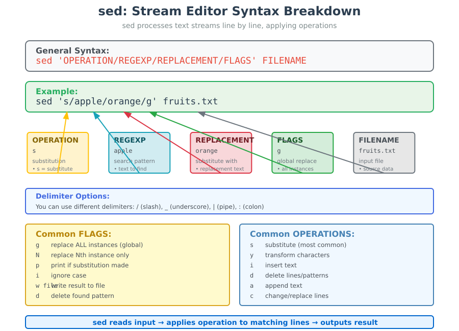

# 4. Inspecting and Manipulating Text Data with Unix Tools - Part 2

!!! clipboard-list "Lesson Objectives"
     
    * insertion, deletion, search and replace(substitution) with `sed`

<figure markdown>
{width="300"}
</figure>


!!! circle-info "Introduction to `sed`"
    #### 1. WHAT IS `sed`  & WHAT CAN WE DO WITH IT?
    The `s`treamline `ed`itor or `sed` command  is a powerful text processing tool in Unix and Linux systems used to perform automated editing and transformation of text, especially within files or data streams 
    - Most common use of `sed` is to substitute text, matching a pattern. The syntax for doing this in `sed` is as follows:

    #### 2. Core Concepts - The Foundation
    1. Stream Processing:
        - Reads input line by line, applies operations, outputs results
        - Think: Input → sed operations → Output
    2. Address-Command Structure:

        - Format: `[address]command`
        - Address = which lines to target (optional)
        - Command = what operation to perform

    3. Common Operations:

        - `s` = substitute (find/replace)
        - `d` = delete
        - `i/a` = insert/append
        - `y` = transform characters

    >Mental Model: sed is a "text assembly line" - each input line gets processed through your editing operations.

    #### 3. Basic Syntax
    ```bash
    sed 'OPERATION/REGEXP/REPLACEMENT/FLAGS' FILENAME
    ```
     <figure markdown>
     
     </figure>

     
    - Here, `/` is the delimiter (you can also use `_` (underscore), `|` (pipe) or `:` (colon) as delimiter as well)
    - `OPERATION` specifies the action to be performed (sometimes if a condition is satisfied). 
         - The most common and widely used operation is `s` which does the **substitution** operation 
         - Other useful operators include `y` for **transformation**, `i` for **insertion**, `d` for **deletion** etc.).
    - `REGEXP` and `REPLACEMENT` specify search term and the substitution term respectively for the operation that is being performed.
    - `FLAGS` are additional parameters that control the operation. Some common `FLAGS` include:
        - `g`	replace all the instances of `REGEXP` with `REPLACEMENT` (globally)
        - `N` where N is any number, to replace Nth instance of the `REGEXP` with `REPLACEMENT`
        - `p` if substitution was made, then prints the new pattern space
        - `i` ignores case for matching `REGEXP`
        - `w` file If substitution was made, write out the result to the given file
        - `d` when specified without `REPLACEMENT`, deletes the found `REGEXP`

* Some find and replace examples


!!! terminal-2 "Find and replace all `chr` to `chromosome` in the example.bed file and append the the edit to a new file names example_chromosome.bed"

    ```bash
    sed 's/chr/chromosome/g' example.bed > example_chromosome.bed
    ```


!!! terminal-2 "Find and replace `chr` to `chromosome`, only if you also find **40** in the line"

    - This will follow the format `sed '/SEARCH_STRING/OPERATION/REGEXP/REPLACEMENT/FLAGS' FILENAME` where `SEARCH_STRING` is **40**
    ```bash
    sed '/40/s/chr/chromosome/g' example.bed > example_40.bed
    ```
    * `/40/`: This is an address (a pattern match) that restricts the following command to only those lines containing the string "40"

    ??? clipboard-question "Why is this useful ?" 

        This command is particularly useful for processing genomic data files, where you might want to change the chromosome notation (from "chr" to "chromosome") only for a specific chromosome 

!!! terminal-2 "Find and replace directly on the input, but save an old version too"

    ```bash
    sed -i.old 's/chr/chromosome/g' example.bed
    ```
    !!! info ""

        - `-i` to edit files **in-place** instead of printing to standard output
        - original file will be retained under the filename `example.bed.old`

    ??? clipboard-question "Why is this useful ?"

        - ^^Standardizing nomenclature^^: In genomics, chromosomes are sometimes abbreviated as "chr" (e.g., chr1, chr2), but some tools or databases might require the full word "chromosome". This command helps standardize the format.
        - ^^File format conversion^^: It can help convert between different file formats or standards that use different chromosome naming conventions.
        - ^^Data cleaning^^: If you have a large dataset with inconsistent chromosome naming, this command can quickly standardize it.
        - ^^Preparing data for specific tools^^: Some bioinformatics tools might require a specific format for chromosome names, and this command can help prepare your data.
        - ^^Safety^^: The -i.old option creates a backup, allowing you to revert changes if needed.
        - ^^Efficiency^^: It can process large files quickly, which is common in genomics data.
        - ^^Reproducibility^^: This command can be easily incorporated into scripts or pipelines, ensuring consistent data processing.

!!! circle-info ""
    **Now that we've seen how sed processes and modifies files, let's understand an important aspect of how sed displays its output**...


### Understanding sed's Default Behavior and the `-n` Flag

#### `sed`s Default Behavior: The Auto-Print Feature

By default, `sed` automatically prints every line from the input file to standard output, regardless of whether any operations were performed on that line. This is called **automatic printing of pattern space**.

!!! circle-info "Pattern Space"
    The pattern space is sed's internal buffer where it holds the current line being processed. Think of it as sed's "working memory" for each line.

Let's see this in action:

!!! terminal-2 "Default behavior example - sed prints ALL lines"
    - Let's say we have a simple file with 5 lines
    ```
    echo -e "chr1\nchr2\nchr3\nchr4\nchr5" > test.txt
    ```

    - Now let's replace only chr3 with chromosome3
    ```
    sed 's/chr3/chromosome3/' test.txt
    ```
    * Notice that `sed` printed all 5 lines, even though it only modified line 3. This is sed's default behavior - it acts like a "stream editor" that processes and outputs every line

##### When This Default Behavior Becomes a Problem
The default behavior can cause issues when you want to:

- Print only specific lines
- Print only lines that match certain conditions
- Extract specific information without showing unchanged lines

!!! terminal-2 "Problem example - Trying to print only the 3rd line"

    ```bash
    sed '3p' example.bed
    ```
    You will notice he 3rd line appears twice because:

    - `sed` automatically prints all lines (including line 3)
    -   The `p` command explicitly prints line 3 again
    
##### How to over-ride the default behaviour

The `-n` flag (also `--quiet` or `--silent`) suppresses automatic printing. With `-n`, `sed` only prints when you explicitly tell it to using commands like `p`

```bash
sed -n '3p' example.bed
```

#### Practical Examples for Bioinformatics

!!! terminal-2 "Example 1: Extracting specific lines from a BED file"

    ```bash
    sed -n '2,6p' example.bed
    ```

    !!! info ""

    - `'2,6p'`: This is the command within sed. The 2,6 specifies the range of lines, and p stands for print. So, 2,6p means "print lines 2 through 6"

!!! terminal-2 "Example 2: Finding lines with successful substitutions"
    - Show only lines where chr was replaced with chromosome
    ```bash
    sed 's/chr3/chromosome3/g' test.bed
    ```
    ```bash
    sed -n 's/chr3/chromosome3/gp' test.bed
    ```
    * The `p` flag after `g` means "print if substitution was made". Combined with `-n`, this shows only modified lines.

!!! terminal-2 "Example 3: Extract sequence and header from a .fastq file"

    ```bash
    sed -n '1~4p;2~4p' SRR097977.fastq
    ```
    !!! info ""
    - `'1~4p;2~4p'`: This is the sed script, which consists of two address/action pairs separated by a semicolon:
        - `1~4p`: This means "starting at line 1, print every 4th line"
        - `2~4p`: This means "starting at line 2, print every 4th line"

    ??? clipboard-question "Why is this userful ?"

        - Quickly view or extract just the sequence data and identifiers from a FASTQ file
        - Reduce the file size by removing quality score information
        - Prepare the data for further processing that only requires the sequence and its identifier

!!! tip "Sanity Check"

    It's not a bad practice validate some of these commands by comparing the output from another command. For an example, above `sed -n '1~4p;2~4p' SRR097977.fastq` should print exactly half the number of lines in the file as it is removing two lines per read. Do a quick sanity check with `sed -n '1~4p;2~4p' SRR097977.fastq  | wc -l` & `cat SRR097977.fastq | wc -l`


!!! terminal-2 "Example 4: We can use the above trick to convert the .fastq to .fasta"

    ```bash
    sed -n '1~4p;2~4p' SRR097977.fastq  | sed 's/^@/>/g' > SRR097977.fasta
    ```
    !!! info ""
    - `^@`: Matches the `'@'` character at the beginning of a line
    - `>:` Replaces the matched `'@'` with `'>'`

    ??? clipboard-question "Why is this useful"
        - **Format Conversion**: It quickly converts a FASTQ file to a FASTA file, which is a common requirement in many bioinformatics workflows.
        - **Data Reduction**: It removes the quality score information, which is not used in FASTA format, potentially reducing file size.
        - **Compatibility**: Many bioinformatics tools work with FASTA format, so this conversion can be a necessary preprocessing step.
        - **Efficiency**: It performs the conversion using efficient text-processing tools, which can be faster than some scripted solutions, especially for large files.
        - **Pipeline Integration**: This one-liner can be easily integrated into larger bioinformatics pipelines or scripts.

<br>
??? surprise "Optional (Advanced) -Let's say that we want capture all the transcript names from the last column (9th column) from .gtf file. We can write something similar to:"

    !!! terminal "code"
    
        ```bash
        grep -v "^#" Mus_musculus.GRCm38.75_chr1.gtf | head -n 3 | sed -E 's/.*transcript_id "([^"]+)".*/\1/'
        ```
    !!! info ""
        `-E` option to enable POSIX Extended Regular Expressions (ERE)
    
        ??? pied-piper "POSIX Regular and Exetended Regular Expressions"
    
             **POSIX Basic Regular Expressions** 
    
             * POSIX or “Portable Operating System Interface for uniX” is a collection of standards that define some of the functionality that a (UNIX) operating system should support. One of these standards defines two flavors of regular expressions. Commands involving regular expressions, such as `grep` and `egrep`, implement these flavors on POSIX-compliant UNIX systems. Several database systems also use POSIX regular expressions.
            
                The Basic Regular Expressions or BRE flavor standardizes a flavor similar to the one used by the traditional UNIX `grep` command. This is pretty much the oldest regular expression flavor still in use today. One thing that sets this flavor apart is that most meta-characters require a backslash to give the metacharacter its flavor. Most other flavors, including POSIX ERE, use a backslash to suppress the meaning of metacharacters. Using a backslash to escape a character that is never a metacharacter is an error.
    
            **POSIX Extended Regular Expressions**
    
            * The Extended Regular Expressions or ERE flavor standardizes a flavor similar to the one used by the UNIX `egrep` command. “Extended” is relative to the original UNIX `grep`, which only had bracket expressions, dot, caret, dollar and star. An ERE support these just like a BRE. Most modern regex flavors are extensions of the ERE flavor. By today’s standard, the POSIX ERE flavor is rather bare bones. The POSIX standard was defined in 1986, and regular expressions have come a long way since then.
    
                The developers of `egrep` did not try to maintain compatibility with `grep`, creating a separate tool instead. Thus `egrep`, and POSIX ERE, add additional metacharacters without backslashes. You can use backslashes to suppress the meaning of all metacharacters, just like in modern regex flavors. Escaping a character that is not a meta-character is an error.
    
    
    Output is not really what we are after,
    
    >```bash
    >1	pseudogene	gene	3054233	3054733	.	+	.	gene_id "ENSMUSG00000090025"; gene_name "Gm16088"; gene_source "havana"; gene_biotype "pseudogene";
    >ENSMUST00000160944
    >ENSMUST00000160944
    >```
    
    The is due to `sed` default behaviour where it prints every line, making replacements to matching lines. .i.e Some lines of the last column of *Mus_musculus.GRCm38.75_chr1.gtf* don't contain `transcript_id`. So, `sed` prints the entire line rather than captured group. One way to solve this would be to use `grep` `transcript_id` before `sed` to only work with lines containing the string `transcript_id` . However, `sed` offers a cleaner way. First, disable `sed` from outputting all lines with `-n` ( can use `--quiet` or `--silent` as well .i.e. *suppress automatic printing of pattern space*). Then, by appending `p` (*Print the current pattern space*) after the last slash `sed` will print all lines it’s made a replacement on. The following is an illustration of `-n` used with `p`:
    
    !!! terminal "code"
    
        ```bash
        grep -v "^#" Mus_musculus.GRCm38.75_chr1.gtf | head -n 3 | sed -E -n 's/.*transcript_id "([^"]+)".*/\1/p'
        ```
    This example uses an important regular expression idiom: capturing text between delimiters (in this case, quotation marks). This is a useful pattern, so let’s break it
    down:
    
    1. First, match zero or more of any character ( .* ) before the string "transcript_id" .
    2. Then, match and capture (because there are parentheses around the pattern) one or more characters that are not a quote. This is accomplished with [^"]+ , the important idiom in this example. In regular extension jargon, the brackets make up a character class. Character classes specify what characters the expression is allowed to match. Here, we use a caret ( ^ ) inside the brackets to match anything except what’s inside these brackets (in this case, a quote). The end result is that we match and capture one or more nonquote characters (because there’s a trailing + ). This approach is nongreedy; often beginners make the mistake of taking a greedy
    approach and use .* . Consider:
    
- - - 

    

- - - 
<p align="center"><b><a class="btn" href="https://genomicsaotearoa.github.io/shell-for-bioinformatics/" style="background: var(--bs-dark);font-weight:bold">Back to homepage</a></b></p>
